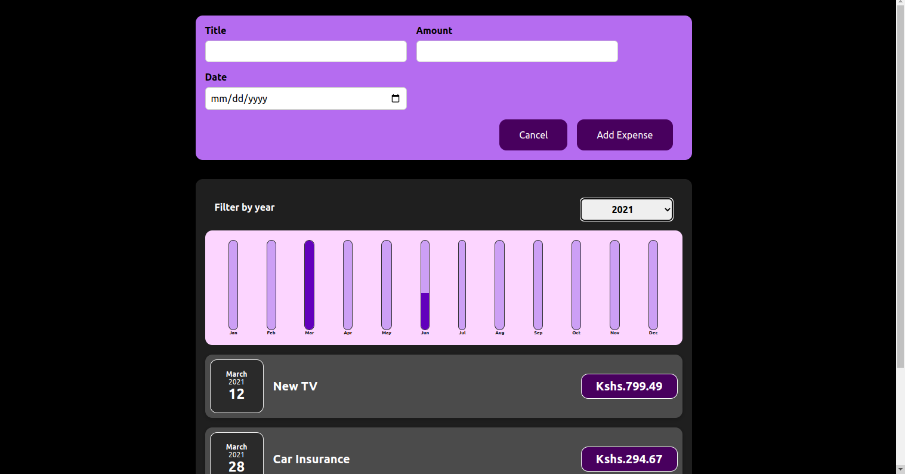

# Expense Tracker

This is a react project that allows a user to track their expenses over the year and compare the expenses over a period of time.

## Project image

### Technologies used

* ReactJs
* JSX
* CSS
* Bootstrap

#### Deployment

Here's the [Deployed link](https://expense-tracker-sheready.vercel.app/)
